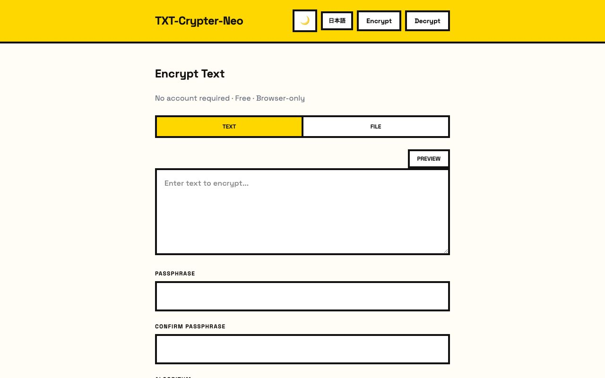

[](https://github.com/watanabe3tipapa/txt-crypter-neo)

<!-- badges -->
[](LICENSE)
[](https://github.com/watanabe3tipapa/txt-crypter-neo/commits/main)
[](https://github.com/watanabe3tipapa/txt-crypter-neo/actions)
[](CONTRIBUTING.md)
[](https://github.com/watanabe3tipapa/txt-crypter-neo)

[English](README.md) | [日本語](README_ja.md)

# TXT-Crypter-Neo

A browser-only text and file encryption tool. No server required — all encryption happens locally in your browser using the Web Crypto API. Share encrypted messages via URL or encrypted files with anyone who knows the passphrase.

## Features

- **Browser-Only** — Everything runs client-side. No data is ever sent to a server.
- **Two Encryption Algorithms** — PBKDF2 + AES-CBC (backward compatible with original TXT-Crypter) and Argon2id + AES-CBC (stronger key derivation).
- **File Encryption** — Encrypt any file and share it as a `.enc` file. Decrypt with the correct passphrase.
- **PWA** — Installable as a progressive web app. Works offline after first visit.
- **QR Code** — Generate QR codes for encrypted URLs.
- **URL Shortening** — Shorten encrypted URLs via TinyURL.
- **Markdown Preview** — Preview formatted text before encrypting, and render decrypted text as Markdown.
- **Dark Mode** — System-aware with manual toggle and persistent preference.
- **Multi-Language** — Japanese and English.

## Screenshot



## Live Demo

- **GitHub Pages**: [https://watanabe3tipapa.github.io/txt-crypter-neo/](https://watanabe3tipapa.github.io/txt-crypter-neo/)
- **Cloudflare Pages**: [https://txt-crypter-neo.pages.dev/](https://txt-crypter-neo.pages.dev/)

## Usage

No installation required. Open the live demo, type or paste your text (or select a file), enter a passphrase, and share the generated URL or download the encrypted file.

### Encrypt Text

1. Go to the Encrypt page
2. Type your message
3. Choose an algorithm (PBKDF2 for compatibility, Argon2id for stronger security)
4. Enter and confirm a passphrase
5. Click "Generate URL"
6. Share the URL with anyone who knows the passphrase

### Decrypt Text

1. Go to the Decrypt page
2. Paste the encrypted URL
3. Enter the passphrase
4. Click "Decrypt"

### Encrypt Files

1. Switch to "File" mode on the Encrypt page
2. Select a file
3. Enter a passphrase
4. Click "Encrypt & Download" to save the `.enc` file

### Decrypt Files

1. Switch to "File" mode on the Decrypt page
2. Select the `.enc` file
3. Enter the passphrase
4. Click "Decrypt & Download" to get the original file

## Technology Stack

| Category  | Technology |
|-----------|-----------|
| Framework | Astro (static output) |
| Language  | TypeScript |
| UI        | Tailwind CSS + neo-brutalism |
| Encryption| Web Crypto API (PBKDF2 / Argon2id via hash-wasm) |
| Testing   | Vitest |
| Package   | pnpm |
| Deploy    | GitHub Pages + Cloudflare Pages |

## Local Development

```bash
# Clone the repository
git clone https://github.com/watanabe3tipapa/txt-crypter-neo.git

# Navigate to the directory
cd txt-crypter-neo

# Install dependencies
pnpm install

# Start dev server
pnpm run dev

# Run tests
pnpm run test

# Build for production
pnpm run build
```

## Contributing

Contributions are welcome! Please read the [CONTRIBUTING.md](CONTRIBUTING.md) and [CODE_OF_CONDUCT.md](CODE_OF_CONDUCT.md) guidelines first.

1. Fork the repository
2. Create your feature branch (`git checkout -b feature/amazing-feature`)
3. Commit your changes (`git commit -m 'Add amazing feature'`)
4. Push to the branch (`git push origin feature/amazing-feature`)
5. Open a Pull Request

## License

MIT License — see the [LICENSE](LICENSE) file for details.

## Contact

GitHub: [https://github.com/watanabe3tipapa/txt-crypter-neo](https://github.com/watanabe3tipapa/txt-crypter-neo)
